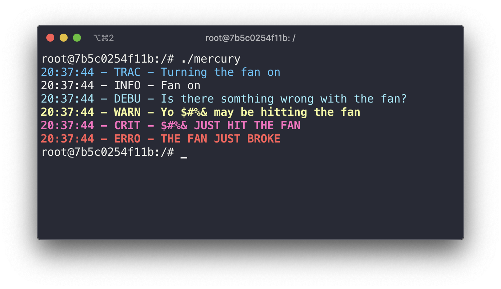

# Mercury

Lightweight & Colorful Singleton logger



## Adding to a Project

This project uses [Quom](https://github.com/Viatorus/quom) to generate a single header file. The latest version of the file can be found [here](). Add this file to your project's includes and start logging!


## Usage


```cpp
// Get the singleton instance of the logger
mercury::Logger &mercury = mercury::Logger::get();

// Set the level (the default is info)
mercury.setLevel(mercury::Level::trace);

// Start logging
mercury.trace("Turning the fan on");
mercury.info("Fan on");
mercury.debug("Is there somthing wrong with the fan?");
mercury.warn("Yo $#%& may be hitting the fan");
mercury.critical("$#%& JUST HIT THE FAN");
mercury.error("THE FAN JUST BROKE");
```


## Logging Levels

*When a log level is set all proceeding levels will also be logged*

**Trace**: Shows the execution path of a program

**Debug**: fine-grained informational events for debugging

**Info**: Messages highlighting the process of a program

**Warn**: Potentially harmful situation has occurred

**Critical**: Error events that might still allow allow the program to run

**Error**: Severe event that forces the termination of the program

**Off**: The logger is off.

### Setting Log Level

```cpp
// Set the level (the default is off)
mercury.setLevel(mercury::Level::info);
```


## Theming

How do I access mercury's theme object?

```cpp
// Get the pointer to the theme used by mercury
mercury::Theme *t = mercury.getTheme();
```

### Seperator

```cpp
// Set the exact characters that seperate each col of the log
t -> setSeperator(false);
```

### Level Name Length

```cpp
/*
* Set the number of characters the Level names are printed 
* with, the max being 8, default is 4
*/ 
t -> setLevelNameLen(1);
```

### Disable Timestamp

Why on earth would you do this? Nevertheless, heres how:

```cpp
// Disable one of the 3 important aspects of a log
t -> setIsTimestampEnabled(false);
```

### Unix Only

Color Theming for Mercury is supported on Unix-like systems as a consequence of it usage of ANSI escape codes. However if you arent using a Unix-Like system reevalute your descions up to this point as a devloper. 

#### Editing Theme

```cpp
/*
* Using the setter for any of the levels, overwrite the default values
* All possible values can be seen in the table below
*/ 
t -> setInfo(mercury::Vector2 { COLOR_CODE, STYLE_CODE });
```

#### Colors

|  Color  | Foreground | Background |
| :-----: | :--------: | :--------: |
|  Black  |     30     |     40     |
|   Red   |     31     |     41     |
|  Green  |     32     |     42     |
| Yellow  |     33     |     43     |
|  Blue   |     34     |     44     |
| Magenta |     35     |     45     |
|  Cyan   |     36     |     46     |
|  White  |     37     |     47     |


#### Styling

|   Effect    | Value |
| :---------: | :---: |
|    reset    |   0   |
| bold/bright |   1   |
|  Underline  |   4   |
|   Inverse   |   7   |


## Packaging

*Generates a new single header from source usion [Quom](https://github.com/Viatorus/quom)*

`make package`

## Development

`make dev`

## Found a bug?

Please let me know! Follow the link [here](https://github.com/dgisolfi/Mercury/issues) to submit an issue.

